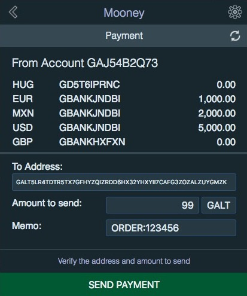
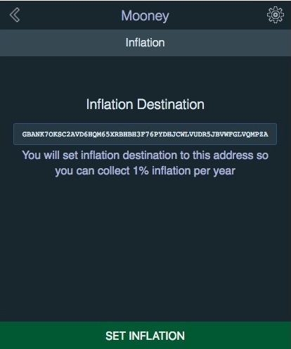
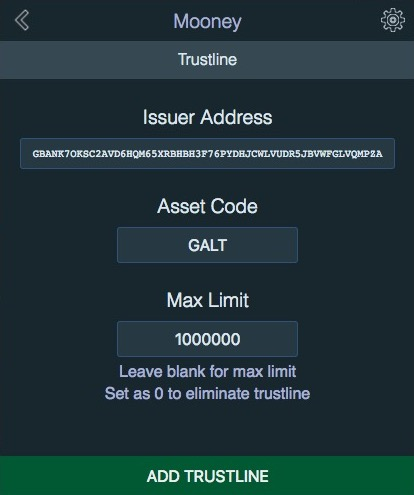
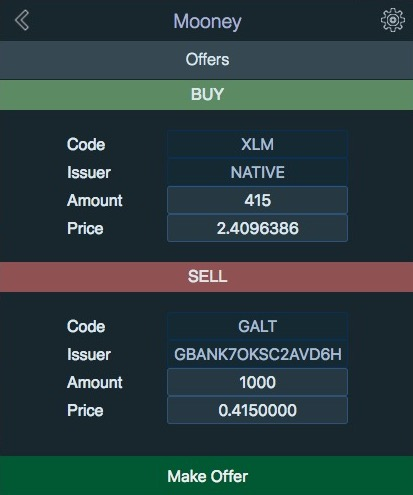

# MOONEY

**Mooney** is a Stellar Wallet installed as a browser extension that allows you to have all the power of Stellar at your fingertips while browsing. Its main focus is interacting with web pages that provide transactions as links using the uri standard web+stellar so you can pay for stuff with just one click, it also can be used as a stand alone wallet by clicking on the nice little rocket icon on the toolbar.

**Mooney** comes as an extension for Firefox, Chrome, Opera and Safari. It will be available in their respective app stores soon.

### Screenshots

## TODO:

- [ ] Chrome Play Store
- [ ] Firefox Add-ons
- [ ] Apple App Store
